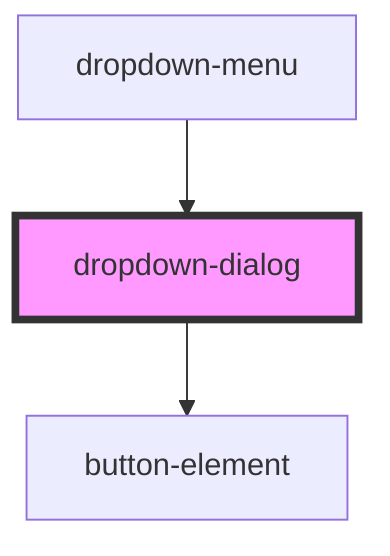

# dropdown-dialog

<!-- Auto Generated Below -->

## Properties

| Property | Attribute | Description | Type      | Default |
| -------- | --------- | ----------- | --------- | ------- |
| `open`   | `open`    |             | `boolean` | `false` |

## Events

| Event         | Description | Type               |
| ------------- | ----------- | ------------------ |
| `openChanged` |             | `CustomEvent<any>` |

## Dependencies

### Used by

 - [dropdown-menu](../dropdown-menu)

### Depends on

- [button-element](../button-element)

### Graph

----------------------------------------------

*Built with [StencilJS](https://stenciljs.com/)*
