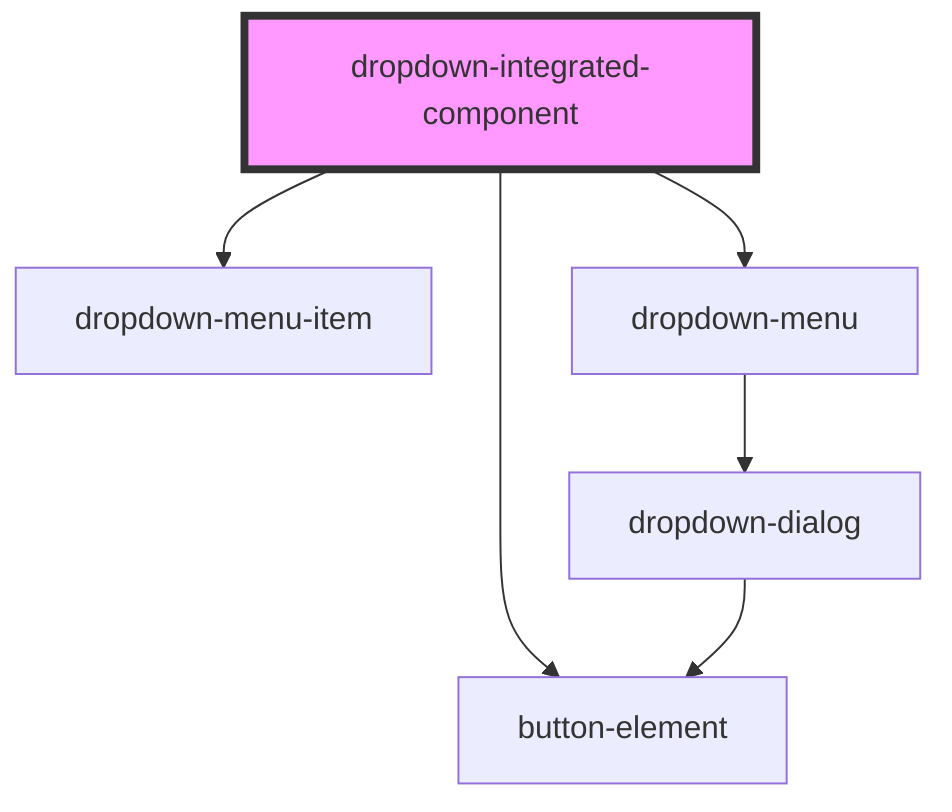

# dropdown-integrated-component

<!-- Auto Generated Below -->

## Properties

| Property        | Attribute        | Description | Type           | Default     |
| --------------- | ---------------- | ----------- | -------------- | ----------- |
| `data`          | `data`           |             | `[] \| string` | `undefined` |
| `resetValue`    | `resetvalue`     |             | `boolean`      | `undefined` |
| `selectedValue` | `selected-value` |             | `string`       | `undefined` |

## Dependencies

### Depends on

- [dropdown-menu-item](../dropdown-menu-item)
- [button-element](../button-element)
- [dropdown-menu](../dropdown-menu)

### Graph

----------------------------------------------

*Built with [StencilJS](https://stenciljs.com/)*
