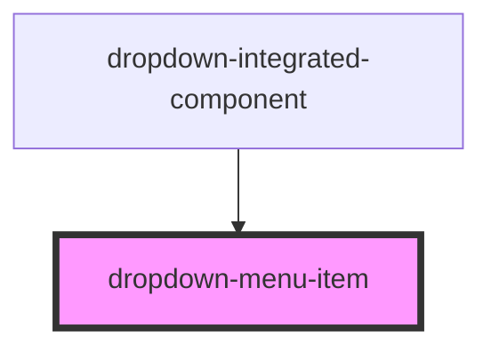

# dropdown-menu-item

<!-- Auto Generated Below -->

## Properties

| Property | Attribute | Description | Type      | Default     |
| -------- | --------- | ----------- | --------- | ----------- |
| `open`   | `open`    |             | `boolean` | `false`     |
| `option` | `option`  |             | `string`  | `undefined` |

## Events

| Event         | Description | Type               |
| ------------- | ----------- | ------------------ |
| `openChanged` |             | `CustomEvent<any>` |

## Dependencies

### Used by

 - [dropdown-integrated-component](../dropdown-integrated-component)

### Graph

----------------------------------------------

*Built with [StencilJS](https://stenciljs.com/)*
