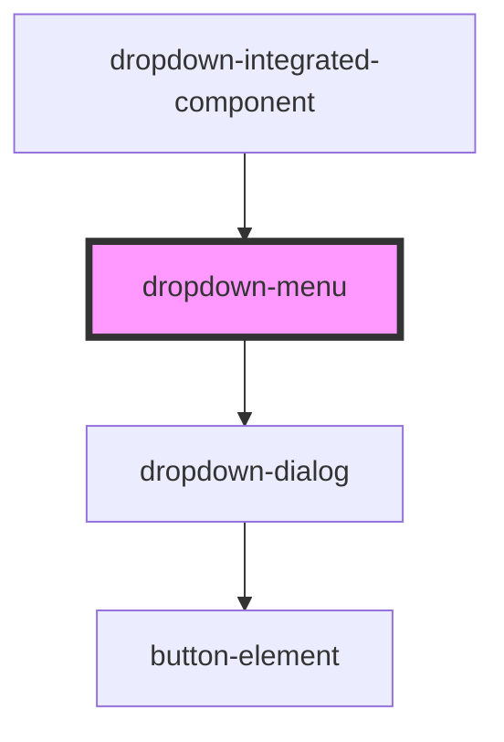

# dropdown-menu

<!-- Auto Generated Below -->

## Properties

| Property | Attribute | Description | Type     | Default     |
| -------- | --------- | ----------- | -------- | ----------- |
| `title`  | `title`   |             | `string` | `undefined` |

## Events

| Event         | Description | Type               |
| ------------- | ----------- | ------------------ |
| `openChanged` |             | `CustomEvent<any>` |

## Dependencies

### Used by

 - [dropdown-integrated-component](../dropdown-integrated-component)

### Depends on

- [dropdown-dialog](../dropdown-dialog)

### Graph

----------------------------------------------

*Built with [StencilJS](https://stenciljs.com/)*
